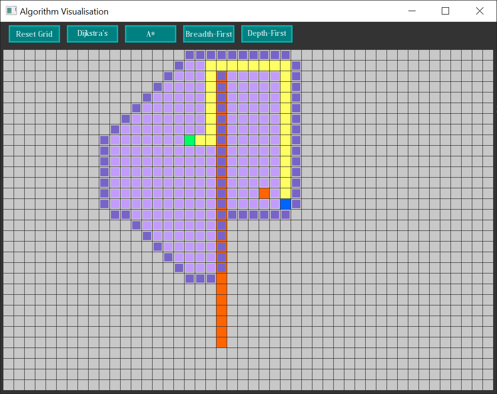

# AlgorithmVisualization #
AlgorithmVisualization is a tool to visualize different pathfinding algorithms.
Get the folder inside bin for the latest compiled version or compile it yourself.

- Green is start.
- Blue is finish.
- Orange is a wall.
- Magenta are already searched nodes.
- Violet are adjacent nodes to already visited nodes.
- Yellow is the found path.

## How to use ##
- Click onto a field to change it to a wall.
- Reset Grid will assign random positions to start and finish and erase all walls.
- Started algorithms run until finished, all possible nodes are explored or Reset Grid is pressed.
